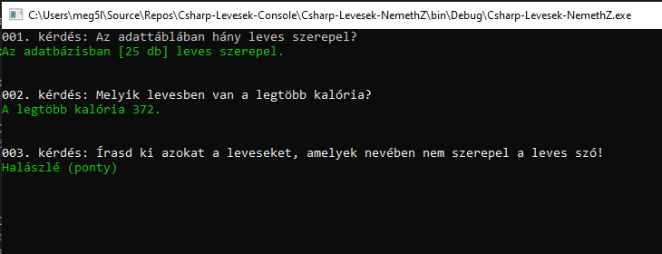

#Konzolos feladat:

`készíts grafikus alkalmazást új leves rögzítésére`

` az adattáblában hány leves szerepel?`

`Melyik levesben van a legtöbb kalória?`

`írasd ki azokat a leveseket, amelyek nevében nem szerepel a leves szó!`

